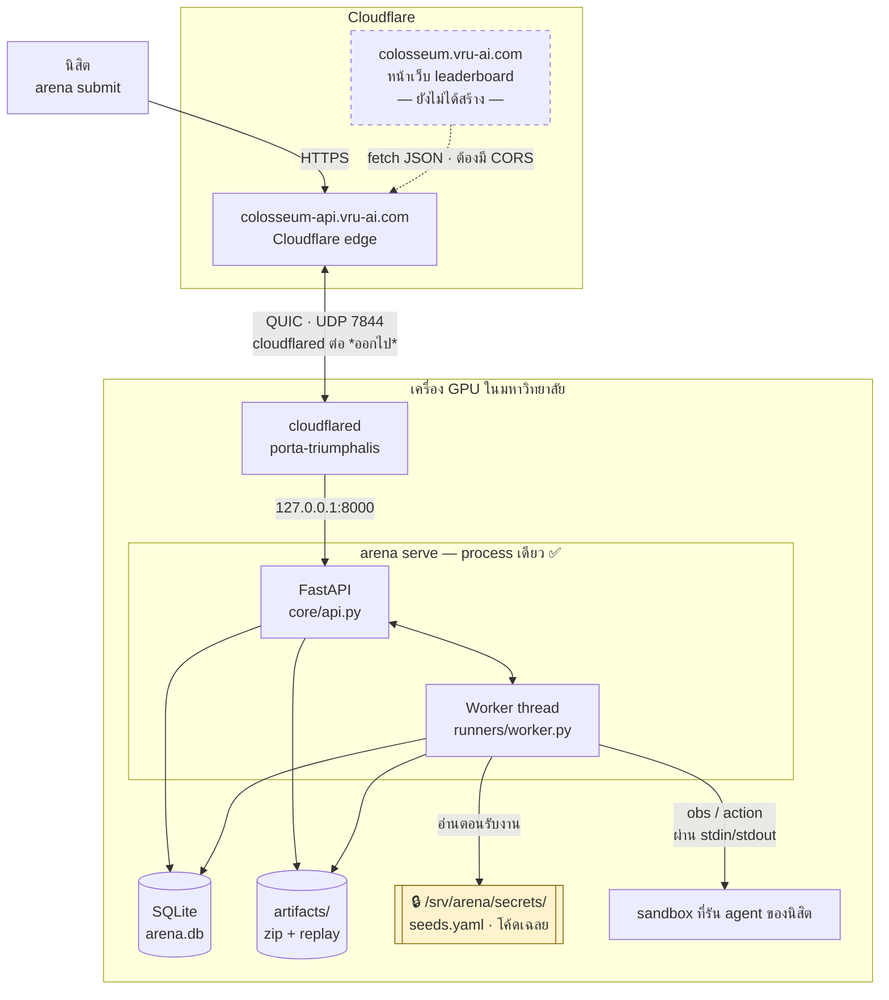
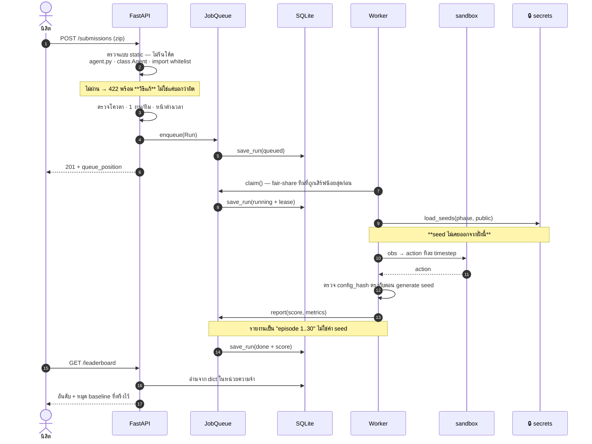
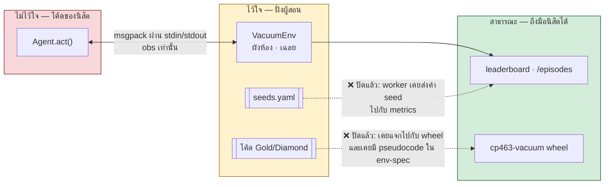

# สถาปัตยกรรม — สิ่งที่มีจริงวันนี้

**เอกสารนี้อธิบายระบบที่รันได้จริง ณ วันที่ 20 ส.ค. 2026** ส่วน
[README §10](../README.md#10-สถาปัตยกรรมระบบ) เป็น**เป้าหมายที่ออกแบบไว้** ซึ่งบางส่วน
ยังไม่ได้สร้าง การอ่าน §10 อย่างเดียวจะเข้าใจผิดว่าระบบทำอะไรได้บ้าง

> ทุกครั้งที่แก้โครงสร้างจริง **ต้องแก้ไฟล์นี้ในคอมมิตเดียวกัน** — เอกสารสถาปัตยกรรม
> ที่ตามหลังโค้ดคือเอกสารที่คนอ่านแล้วตัดสินใจผิด

---

## 1. ภาพรวมของการติดตั้ง



**ทำไม cloudflared ต่อออกไปแทนที่จะเปิด port รับ** — เครื่องในมหาวิทยาลัยอยู่หลัง firewall
ที่ขอเปิด inbound port ยาก การให้ tunnel ต่อออกไปติดตั้งได้ทันทีและไม่มี port เปิดรับ
จากอินเทอร์เน็ตเลย · ผลการวัดบนเครือข่ายจริงอยู่ที่
[README §10.1](../README.md#101-ภาพรวม-hybrid-web-บน-cloud--runner-ในมหาวิทยาลัย)
และวิธีติดตั้งอยู่ที่ [deploy/cloudflared/](../deploy/cloudflared/README.md)

### ต่างจาก README §10 ตรงไหน

| §10 วางไว้ | วันนี้ | ผลที่ตามมา |
|---|---|---|
| runner เป็น daemon แยกเครื่อง ต่อ WebSocket เข้ามา | worker เป็น **thread ใน process เดียวกับ API** | ยังกระจายงานข้ามเครื่องไม่ได้ · WebSocket ที่วาดไว้ยังไม่มีอยู่จริง |
| Postgres + Redis | **SQLite** write-through ([`core/db.py`](../core/db.py)) | รองรับ process เดียว ซึ่งพอดีกับข้อบน |
| Object Storage | โฟลเดอร์บนดิสก์ ([`core/store.py`](../core/store.py)) | ต้องสำรองไฟล์เอง |
| หน้าเว็บ leaderboard | ยังไม่มี — เข้าถึงผ่าน CLI กับ REST เท่านั้น | นิสิตยังต้องใช้ terminal |

---

## 2. เส้นทางของ submission



heartbeat ต่ออายุ lease ทุก 20 วินาที ถ้า worker ตายกลางคัน lease หมดอายุแล้วงานกลับเข้าคิวเอง
งานที่ล้มซ้ำเกิน 3 ครั้งถูกทำเครื่องหมายว่าล้มเหลว ไม่วนไม่รู้จบ ([`core/queue.py`](../core/queue.py))

---

## 3. ขอบเขตความไว้วางใจ — เส้นทางของของลับ



สามชั้นที่บังคับไว้เชิงโครงสร้าง ไม่ใช่เชิงวินัย

| ชั้น | บังคับด้วย |
|---|---|
| agent อยู่คนละ process กับ environment | [`runners/agent_env/launcher.py`](../runners/agent_env/launcher.py) — `import gc` แล้วไล่หา env ไม่เจอเพราะมันไม่ได้อยู่ใน process เดียวกัน |
| API ไม่เคยเห็นค่า seed | worker เป็นคนอ่านจาก `ARENA_SECRETS` และรายงานเป็นเลขลำดับ · เทสต์ `test_api_never_reveals_seed_values` |
| โค้ดเฉลยไม่อยู่ในแพ็กเกจที่แจก | `ARENA_SECRETS` เท่านั้นที่โหลด Gold/Diamond ได้ · pre-commit hook ตรวจว่าไม่มีวิธี implement หลุดเข้า repo สาธารณะ |

รายละเอียดเต็มอยู่ที่ [README §10.4](../README.md#104-ขอบเขตความไว้วางใจ-trust-boundaries)

---

## 4. ⚠️ ช่องว่างที่รู้ตัว

### 4.1 ~~`smoke_test()` ไม่ถูกเรียกใช้จริง~~ ✅ ปิดแล้ว

`smoke_test()` เขียนครบและมีเทสต์ของตัวเอง 6 ข้อมาตลอด **แต่ไม่มีใครเรียกมันนอกจากเทสต์**
ผลคือ starter kit ที่บอกนิสิตว่า "ระบบตรวจข้อนี้ตอนรับ submission และ**ปฏิเสธ**ถ้าไม่ผ่าน"
ไม่เป็นความจริง — agent ที่ `reset()` ไม่สะอาดถูกรับเข้าไปแล้วได้คะแนนต่ำกว่าที่ควร
โดยไม่มีใครบอกว่าเพราะอะไร ซึ่งเป็นอาการที่ debug ยากที่สุด

ตอนนี้ [`runners/worker.py`](../runners/worker.py) เรียกก่อนรันจริงแล้ว และเทสต์ที่เพิ่มมา
ตรวจ**การต่อสาย** ไม่ใช่ตัวฟังก์ชัน (`test_state_leaking_agent_is_rejected_by_the_worker`)

**ไม่ตรวจ run แบบ private กับ rejudge โดยตั้งใจ** — submission พวกนั้นผ่าน smoke test
ตอนรัน public มาแล้ว ถ้าตรวจซ้ำแล้วมันล้มด้วยเหตุบังเอิญ final pick ของทีมนั้นจะถูก
ปฏิเสธในรอบตัดเกรด ซึ่งเป็นจังหวะที่แก้ตัวไม่ได้แล้ว

### 4.2 ~~`arena serve` ใช้ SubprocessLauncher ไม่ใช่ Docker~~ ✅ ปิดแล้ว

`Worker.launcher` เคยเป็น `SubprocessLauncher` เสมอและ CLI ไม่มีธงให้เลือก แปลว่าถ้าเปิด
ให้นิสิตส่งงานจริง โค้ดของนิสิตจะรันบนเครื่องที่มีเฉลยอยู่โดยไม่มี container ห่อ

ตอนนี้มี `arena serve --sandbox auto|docker|subprocess`

| โหมด | พฤติกรรม |
|---|---|
| `auto` (ค่าเริ่มต้น) | ใช้ Docker ถ้ามี image พร้อม · ไม่มีก็ถอยไป subprocess **พร้อมเตือนดังๆ** |
| `docker` | ต้องมี Docker — ไม่พร้อมก็ไม่ยอมเริ่ม |
| `subprocess` | บังคับไม่ใช้ container · **ใช้กับ `--real-seeds` ไม่ได้** |

**`--real-seeds` บังคับ Docker เสมอ** — ถ้ากำลังให้คะแนนด้วย seed จริง แปลว่าโค้ดที่รัน
คือของนิสิตและมันอยู่บนเครื่องเดียวกับเฉลย การถอยไป subprocess เงียบๆ ในโหมดนั้นคือ
การรันโค้ดที่ไม่ไว้ใจไว้ข้างๆ ของลับ · เทสต์อยู่ที่ `core/tests/test_cli_sandbox.py`

### 4.3 ที่ยังเหลือ

| | สถานะ |
|---|---|
| หน้าเว็บ leaderboard | ยังไม่มี |
| Google OAuth | ยังใช้ team token แบบ `team-1` |
| runner daemon + WebSocket | ยังไม่มี — worker เป็น thread |
| เพดานไฟล์บน named tunnel | ยังไม่วัด (ที่วัดไปเป็น quick tunnel) |
| replay viewer | ยังไม่มี — มีแต่ไฟล์ `.vrp` |

---

## 5. ที่อยู่ของแต่ละอย่าง

```
colosseum-swu/                    (สาธารณะ)
├── core/          แพลตฟอร์ม — ไม่รู้จักโจทย์ใดๆ
│   ├── domain.py     Team · Competition · Submission · Run
│   ├── queue.py      fair-share + lease + heartbeat
│   ├── db.py         SQLite write-through
│   ├── service.py    กติกาทั้งหมดอยู่ที่นี่ที่เดียว
│   └── api.py        REST · ไม่เคยเห็น seed
├── runners/       รันงาน — ไม่รู้จัก core
│   ├── worker.py     หยิบงาน · โหลด seed · รายงานผล
│   └── agent_env/    protocol · launcher · sandbox
├── envs/          โจทย์ · หนึ่งโฟลเดอร์ต่อหนึ่ง competition
├── deploy/        cloudflared
└── docs/          เอกสารนี้ · สเปคของโจทย์ · task template

colosseum-hypogeum/               (ส่วนตัว · clone เฉพาะเครื่อง GPU)
├── cp463-1-2026/vacuum/seeds.yaml
├── agents/cp463-vacuum/          โค้ด Gold/Diamond
└── docs/cp463-1-2026/vacuum/     สเปคของ baseline ที่ไม่แจก
```

กฎที่ทำให้โครงสร้างนี้ไม่พังตามเวลา: **`core/` ไม่ import `runners/` และกลับกัน**
การผูกทั้งสองฝั่งเกิดที่ [`core/wiring.py`](../core/wiring.py) ที่เดียว การเพิ่ม competition
ใหม่จึงแตะแค่ `envs/` กับไฟล์นั้น ([README §10.5](../README.md#105-โครงสร้าง-repository))
